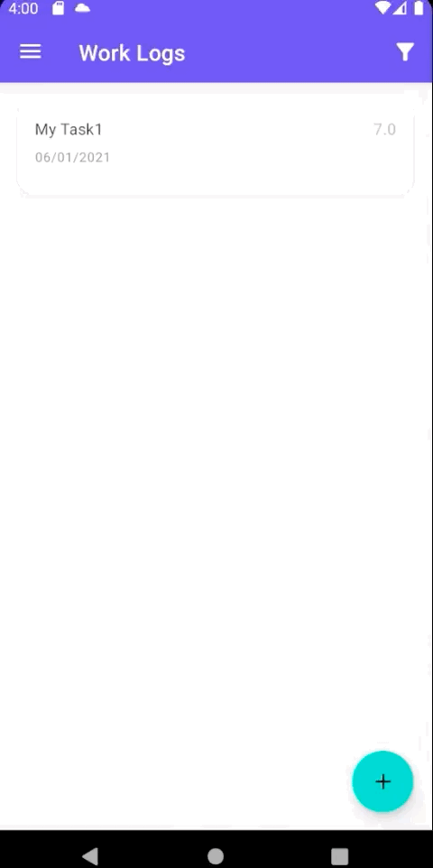
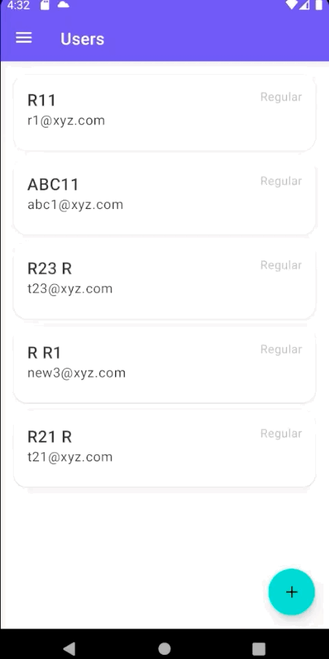
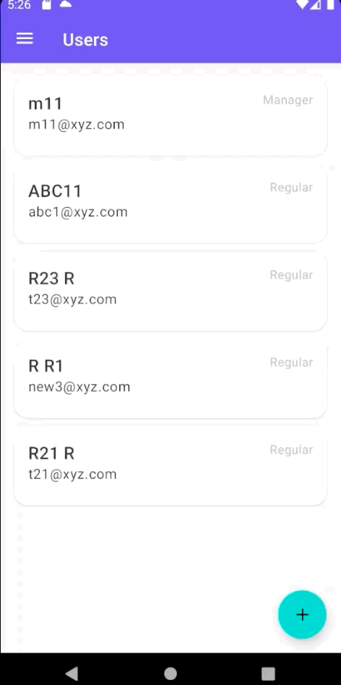

# Work Log Tracker and Management Portal Android App

## App Specifications

- User must be able to create an account and log in. (If a mobile application, this means that more users can use the app from the same phone).
- User can add (and edit and delete) a row describing what they have worked on, what date, and for how long.
- User can add a setting (Preferred working hours per day).
- If on a particular date a user has worked under the PreferredWorkingHourPerDay, these rows are red, otherwise green.
- Implement at least **three roles** with different permission levels: a **regular** user would only be able to CRUD on their owned records, a user **manager** would be able to CRUD users, and an **admin** would be able to CRUD all records and users.
- Filter entries by date from-to.
- Export the filtered times to a sheet in HTML:
	- Date: 2018.05.21
	- Total time: 9h
	- Notes: Notes

	
## Code Architecutre
The app is written purely in **Kotlin** and uses MVVM to keep responsibilities separate and keep UI as dum as possible.

 App is divided into 3 layers.
 
 1. **UI/View** (shows UI with the provided data without any kind of processing)
 2. **Presentation** (Gathers and prepares data for presentation and then forwards it to UI)
 3. **Domain** (remote and local sync, other domain logic)
 4. **Data** (fetching of data and other pure data related manipulation)

### Other Technical Details

- **Kolin Coroutines and Flow** has been used for asynchronous logic.
- [Hilt](https://developer.android.com/training/dependency-injection/hilt-android), written on top of Dagger2, by Google, now officially recommend library by Google, has been used for Dependency Injection.
- **Android JetPack** set of libraries is fully utilized.
- RecyclerView has been used for showing list of items.
- CardView has been used for showing cards in the list.
- ConstraintLayout has been used for efficient layouts.
- Material Design Theme has been used in the app to take advantage of the material design components.
- All strings are translatable and no string is hard coded.
- All colors are themable and now color has been hard coded.

## Backend

- **Firebase** is used for all backend handling.
- Functionality like user creation, update, delete is not possible with Firebase client SDK so cloud functions have to been written in **Type Script** and deployed as Google Cloud Functions. Those functions setup can be found in **backend** folder in the project.

	
# Demo

## Reguar User

| Sign Up | Sign |
| --------| ---- |
|  |  | 

-------

| Preferred Hours Count | Edit Profile |
| --------------------- | -------|
|  |  | 

--------

| Create Log | Edit Log | 
| ---------- | -------- |
|  |  | 

---------

| Delete Log  | Logs Filter & Export | 
| ----------- | -------------------- |
|  |  | 

---
---
---

## Manager

| Create User | Create Manager |
| ------------| -------------- |
|  |  | 

-------

| Edit User | Edit Manager |
| --------- | -------|
|  |  | 

--------

| Delete User | Delete Manager | 
| ----------- | -------------- |
|  |  | 

---------

| Settings  | 
| ----------| 
|  | 

---
---
---

## Admin

An admin can create/edit/delete users/managers same as manager so that flow is completely same. Settings are also same as Manager. The extra stuff that an admin can do includes
- See and Create Admin
- Access each user's work logs and create/edit/delete those logs along with filtering and export of those filtered logs

Above mentioned points are shown as demo below.

| Create Admin | Create User Log |
| ------------| ---------------- |
|  |  | 

-------

| Edit User Log | Delete User Log |
| ------------- | --------------- |
|  |  | 